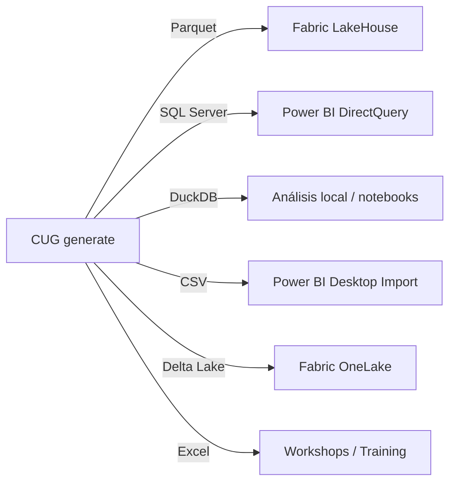

# 🔍 Contoso Data Generator V2 vs Contoso Universe Generator (CUG)
## Análisis Comparativo, Oportunidades de Contribución y Plan de Trabajo

> **Fecha**: 2026-03-12  
> **Autor**: Antigravity + CSalcedoDataBI  
> **Propósito**: Evaluar ventajas, posibilidades de contribución upstream, y estrategia de desarrollo personal

---

## 1. Tabla Comparativa Completa

| Dimensión | **Contoso DG V2** (SQLBI) | **CUG** (PAL Data Team) |
|---|---|---|
| **Propietario** | [SQLBI](https://www.sqlbi.com) (Marco Russo / Alberto Ferrari) | CSalcedoDataBI / PAL Data Team |
| **Licencia** | MIT (© 2022 SQLBI) | MIT (© 2026 CSalcedoDataBI) |
| **Lenguaje** | C# (.NET 8) | Python 3.12+ |
| **Motor de datos** | Custom arrays + `Parallel.For` | Polars (vectorizado) + DuckDB |
| **Clientes sintéticos** | Datos reales descargados de SQLBI GitHub (21 .csv.gz) + GUIDs | Faker multi-locale (8 idiomas) |
| **Formatos de salida** | CSV, Parquet, Delta Table, SQL Server (vía BULK INSERT) | Parquet, CSV, DuckDB, Delta Lake, JSON, Excel, SQL Server (vía pyodbc) |
| **Multi-idioma** | ❌ No (solo inglés) | ✅ 8 idiomas (EN, ES, PT, FR, DE, ZH, JA, AR) |
| **Plugins/Extensibilidad** | ❌ No (schema fijo vía `data.xlsx`) | ✅ YAML category plugins |
| **Configuración** | JSON + CLI params | TOML + CLI flags + CUG-CONFIG.md (agent-driven) |
| **Integración con AI agents** | ❌ No | ✅ Skill nativo (triggers en ES/EN, workflow automatizado) |
| **Validación de integridad FK** | ❌ No | ✅ `--verify` + `--strict` |
| **Volumen probado** | Hasta 100M órdenes | Hasta 10M órdenes (probado); diseño para más |
| **Requisito de Internet** | Sí (primera ejecución, cache posterior) | ❌ No (Faker genera todo localmente) |
| **Dependencia de runtime** | .NET 8 SDK o executable autónomo (~75 MB) | Python 3.12 + `uv` venv |
| **Estrellas GitHub** | ⭐ 70 stars, 18 forks | 🆕 Proyecto nuevo (privado PAL) |
| **Documentación oficial** | [docs.sqlbi.com/contoso-data-generator](https://docs.sqlbi.com/contoso-data-generator/) | MANUAL.md + SKILL.md + CUG-CONFIG.md |
| **Estado del proyecto** | 35 commits, mantenimiento bajo | Desarrollo activo (v0.2.0) |

---

## 2. Ventajas de Cada Herramienta

### ✅ Ventajas de Contoso DG V2 (SQLBI)

| # | Ventaja | Impacto |
|---|---------|---------|
| 1 | **Marca reconocida**: Respaldada por SQLBI con ~70 stars y documentación oficial | Credibilidad inmediata en comunidad Power BI |
| 2 | **Datos de clientes ultra-realistas**: 21 archivos CSV con datos demográficos por país | Mayor realismo sin configuración |
| 3 | **Rendimiento a ultra-escala**: `Parallel.For` nativo de .NET para 100M+ órdenes | Ideal para Fabric/LakeHouse masivos |
| 4 | **Ecosistema SQLBI completo**: Datasets pre-generados listos para descarga | Zero-effort para usuarios finales |
| 5 | **Tipos de cambio ECB reales** descargados del Banco Central Europeo | Realismo financiero |

### ✅ Ventajas de CUG (PAL Data Team)

| # | Ventaja | Impacto |
|---|---------|---------|
| 1 | **100% Python — zero .NET**: No requiere SDK de .NET ni executables pesados | Despliegue universal, CI/CD fácil |
| 2 | **Multi-idioma nativo** (8 idiomas): Nombres, categorías, ciudades localizadas | Demos globales, workshops en español |
| 3 | **7 formatos de salida** incluyendo DuckDB, JSON, Excel | Más flexibilidad que DG V2 |
| 4 | **Sistema de plugins YAML**: Agregar categorías arbitrarias sin tocar código | Extensibilidad para industrias custom |
| 5 | **Agent Skill nativo**: Triggers en español/inglés, workflow automatizado | Integración directa con Antigravity |
| 6 | **Validación de integridad FK**: `--verify` + `--strict` | Calidad del dato garantizada |
| 7 | **Sin internet**: Faker genera todo localmente | Funciona 100% offline, proxy-resistant |
| 8 | **Configuración interactiva**: CUG-CONFIG.md + TOML + CLI | Experiencia developer-first |
| 9 | **Roadmap ambicioso**: Prophet macro-calibration, SDV integration | Datos con realismo macroeconómico |

---

## 3. ¿Podemos Contribuir al Proyecto Original de SQLBI?

### 📋 Análisis Legal y de Políticas

| Aspecto | Estado | Detalle |
|---------|--------|---------|
| **Licencia** | ✅ MIT | Permite uso, modificación, distribución, sublicencia y contribución |
| **CONTRIBUTING.md** | ❌ No existe | No hay guía de contribución oficial |
| **Issues abiertos** | 🔍 Mínimos | Repo con mantenimiento bajo (~35 commits en 4+ años) |
| **Pull Requests** | 🔍 Sin evidencia de PRs aceptados de comunidad | Sin proceso de review documentado |
| **Código de Conducta** | ❌ No existe | Sin governance formal |
| **Fork activo** | ✅ 18 forks existentes | Comunidad pequeña pero real |

### 🚦 Veredicto: Contribuir es Posible pero Improbable que sea Aceptado

> [!IMPORTANT]
> **La licencia MIT permite contribuir (PRs, Issues, Forks).** Sin embargo, el proyecto SQLBI muestra señales de ser un **proyecto "release and maintain"** — mantenido internamente por SQLBI, sin cultura activa de contribución comunitaria.

**Razones por las que un PR probablemente NO sería aceptado:**

1. **Sin CONTRIBUTING.md** → No hay proceso documentado para contribuciones externas
2. **35 commits en 4+ años** → Ritmo de desarrollo muy bajo
3. **Sin Issues/PRs de comunidad activos** → No hay evidencia de review de contribuciones externas
4. **Propiedad corporativa (SQLBI)** → Decisiones de producto controladas internamente
5. **Marco Russo / Alberto Ferrari** → Figuras de la industria que mantienen su propia visión del tool

### ✅ Lo que SÍ Puedes Hacer (Sin Romper Políticas)

| Acción | Viabilidad | Forma |
|--------|-----------|-------|
| **Abrir Issues** sugiriendo features | ✅ Seguro | Issues en GitHub con feature requests bien documentados |
| **Fork público** con mejoras propias | ✅ Legal (MIT) | Crear fork con atribución clara |
| **Publicar CUG como proyecto independiente** | ✅ Legal | Ya es un reimplementación original (NOTICE.md lo establece correctamente) |
| **Escribir blog posts** comparando ambas herramientas | ✅ Excelente visibilidad | Posiciona tu marca CSalcedoDataBI |
| **Enviar un PR experimental** | ⚠️ Posible | De bajo riesgo, pero sin expectativa de merge |

---

## 4. Beneficios Directos para Ti como Desarrollador + Antigravity

> [!TIP]
> **CUG es tu herramienta — y esto tiene valor estratégico enorme.**

### 🎯 Beneficio 1: Workflow Automatizado con Antigravity

```
Tú: "Genera 50K filas en español para SQL Server"
    ↓
Antigravity → [lee CUG-CONFIG.md] → [edita config] → [ejecuta CUG]
    ↓
✅ Dataset listo en 12 segundos → SQL Server poblado
```

**Esto es imposible con DG V2** porque:
- DG V2 no tiene integración con agentes AI
- Requiere compilar .NET, configurar `data.xlsx`, conectar a internet
- No tiene multi-idioma

### 🎯 Beneficio 2: Portafolio y Marca Personal

| Activo | Valor |
|--------|-------|
| **CUG como proyecto open-source** público en GitHub | Demuestra dominio de Python, Polars, DuckDB, CLI design |
| **Blog post comparativo** en csacedodatabi.com | SEO + autoridad en nicho de datos demo |
| **Skill de Antigravity** documentado | Demuestra AI agent engineering |
| **ROADMAP con Prophet + FRED** | Demuestra visión técnica avanzada |

### 🎯 Beneficio 3: Workshops y Demos

CUG te permite:
- Generar datos **en español** para workshops PAL
- Crear datasets **custom** con categorías arbitrarias (YAML plugins)
- Poblar **SQL Server directo** sin pasos intermedios
- Generar en **Excel** para entrenamiento no-técnico
- Producir **DuckDB** para demos de analytics embebido

### 🎯 Beneficio 4: Pipeline de Datos para Modelos Power BI



### 🎯 Beneficio 5: Evolución hacia Realismo Macroeconómico

El ROADMAP de CUG (v0.3) incluye **Prophet + FRED API**, algo que DG V2 **no tiene**:
- Calibración con datos macroeconómicos reales (US Retail Sales)
- COVID spike calibrado (+12-15% vs el irreal +57% de DG V2)
- Crecimiento orgánico +3-5% año/año
- Seasonal Q4 lift calibrado con datos reales

---

## 5. Plan de Trabajo Propuesto

### Fase 1: Consolidación (Semana 1-2)

| Tarea | Prioridad | Detalle |
|-------|-----------|---------|
| 🧪 Test suite completo para CUG | 🔴 Alta | pytest con cobertura de todos los generadores |
| 📝 README.md premium con badges | 🟡 Media | Preparar para publicación pública |
| 🔧 Fix known issues (si existen) | 🔴 Alta | Estabilizar v0.2.0 |
| 📊 Benchmarks CUG vs DG V2 | 🟡 Media | Comparar rendimiento en volúmenes iguales (10K, 100K, 1M) |

### Fase 2: Diferenciación (Semana 3-4)

| Tarea | Prioridad | Detalle |
|-------|-----------|---------|
| 🌍 Validar los 8 idiomas end-to-end | 🔴 Alta | Generar datasets en cada idioma, verificar FK integrity |
| 🔌 Crear 2 category plugins de ejemplo | 🟡 Media | Fashion y Healthcare como demos YAML |
| 📈 Implementar ROADMAP v0.3 (Prophet + FRED) | 🔴 Alta | Macro-economic calibration — GAME CHANGER |
| 📦 Publicar en PyPI | 🟡 Media | `pip install contoso-universe-gen` |

### Fase 3: Visibilidad (Semana 5-6)

| Tarea | Prioridad | Detalle |
|-------|-----------|---------|
| 📝 Blog post: "CUG vs Contoso DG V2" | 🔴 Alta | csacedodatabi.com — SEO positioning |
| 🎥 Video demo | 🟡 Media | YouTube — generación en vivo con Antigravity |
| 🐙 Publicar CUG como repo público | 🔴 Alta | GitHub CSalcedoDataBI org |
| 📢 Post en LinkedIn/Twitter | 🟡 Media | Anunciar el proyecto con benchmarks |

### Fase 4: Integración Avanzada (Semana 7+)

| Tarea | Prioridad | Detalle |
|-------|-----------|---------|
| 🔗 MCP Server para CUG | 🟢 Baja | Exponer CUG como MCP tool server (generate, info, formats) |
| 🏗️ CI/CD pipeline | 🟡 Media | GitHub Actions: test, build, publish to PyPI |
| 🧬 SDV Integration (v0.4) | 🟢 Baja | Si datos reales están disponibles |
| 🌐 Fabric native deployment | 🟡 Media | Notebook que ejecuta CUG directamente en Fabric |

---

## 6. Resumen Ejecutivo

```mermaid
graph TD
    subgraph "Contoso DG V2 (SQLBI)"
        A1[".NET 8 / C#"]
        A2["Solo inglés"]
        A3["70 ⭐ · MIT"]
        A4["CSV / Parquet / Delta"]
        A5["Sin agent integration"]
    end

    subgraph "CUG (PAL Data Team)"
        B1["Python 3.12 / Polars"]
        B2["8 idiomas"]
        B3["Nuevo · MIT"]
        B4["7 formatos"]
        B5["Antigravity Skill nativo"]
        B6["YAML plugins"]
        B7["Roadmap: Prophet + FRED (v0.3)"]
    end

    C{¿Contribuir a SQLBI?}
    C -->|"Improbable: sin CONTRIBUTING.md\nsin review process"| D[❌ No recomendado]
    C -->|"Alternativa"| E["✅ CUG como proyecto\nindependiente y público"]

    E --> F["🎯 Beneficios"]
    F --> F1["Portafolio"]
    F --> F2["Workshops ES"]
    F --> F3["Agent workflow"]
    F --> F4["SEO + Marca"]
```



> [!CAUTION]
> **No mezclar código entre los dos proyectos.** El NOTICE.md de CUG establece claramente esta prohibición. CUG es una reimplementación original — mantener esa separación es crucial para la integridad legal y técnica del proyecto.

---

## 7. Conclusión Final

| Pregunta | Respuesta |
|----------|-----------|
| ¿Hay ventajas entre las dos? | **Sí** — ambas tienen fortalezas distintas. DG V2 tiene la marca SQLBI; CUG tiene multi-idioma, extensibilidad, y integración AI |
| ¿Podemos contribuir a SQLBI? | **Legalmente sí, prácticamente improbable** — sin proceso de contribución activo |
| ¿Qué te beneficia más? | **CUG es tu herramienta estratégica** — portafolio, workshops, agent workflow, marca personal |
| ¿Cuál es el next step? | **Fase 1**: Estabilizar CUG → **Fase 2**: Diferenciación con Prophet (v0.3) → **Fase 3**: Publicación pública |

---

> **Última actualización**: 2026-03-12  
> **Próxima revisión**: Después de completar Fase 1
