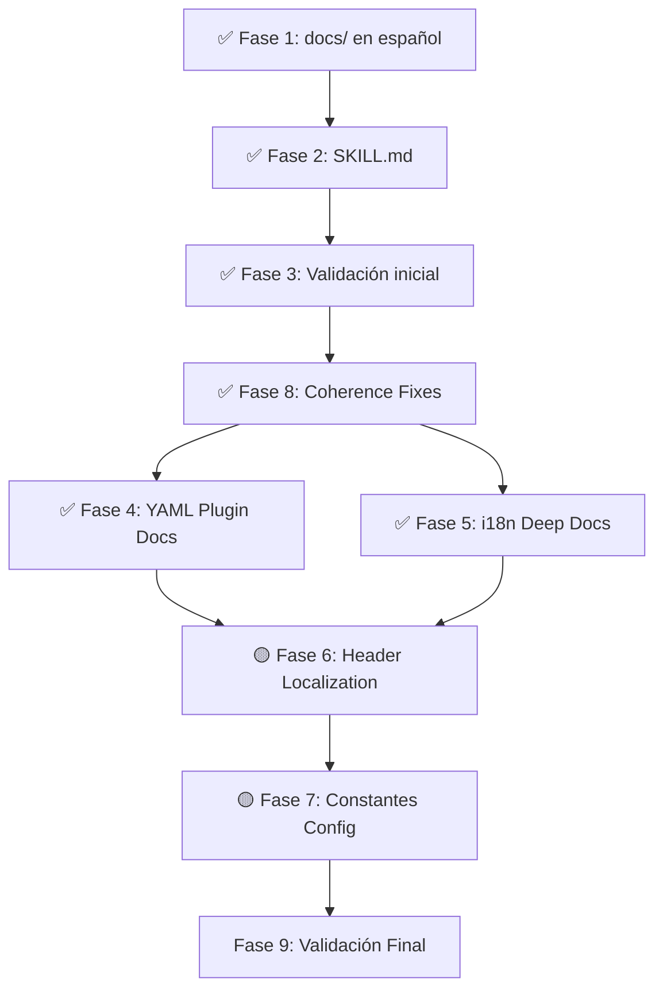

# Plan de Trabajo: Skill CUG + Documentación — Evolución a Control Total

> **Versión**: 2.0 — Actualizado 2026-03-12
> **Última revisión**: Auditoría de coherencia post-Fase 3

## 🎯 Objetivo (Evolucionado)

**Objetivo original (v1.0):** Crear SKILL.md + documentación en español.
**Objetivo actual (v2.0):** Llevar la Skill a **control total** del proyecto CUG — incluyendo localización completa, plugins YAML guiados, y coherencia entre todos los documentos del proyecto.

---

## ✅ Fase 1: Documentación en `docs/` (COMPLETADA)

### Ubicación: `d:\PAL-TEMPORAL-REPORSITORIOS\contoso-universe-gen\docs\`

| Archivo                 | Estado | Contenido                                      |
| ----------------------- | ------ | ---------------------------------------------- |
| `README.md`             | ✅     | Índice general de la documentación             |
| `instalacion.md`        | ✅     | Instalación con pip/uv, prerequisitos, ODBC    |
| `cli-referencia.md`     | ✅     | Comandos CLI con opciones y ejemplos           |
| `configuracion-toml.md` | ✅     | Estructura completa del `.toml`                |
| `formatos-salida.md`    | ✅     | Los 7 formatos soportados                      |
| `esquema-datos.md`      | ✅     | Las 7 tablas, columnas, tipos, relaciones FK   |
| `sqlserver.md`          | ✅     | Guía SQL Server + troubleshooting              |
| `recetas.md`            | ✅     | Recetas rápidas por caso de uso                |

---

## ✅ Fase 2: Skill `contoso-universe-gen` (COMPLETADA)

### Ubicación: `.agent/skills/contoso-universe-gen/SKILL.md`

**Estado**: Creada y funcional como reference card para generación de datos.

---

## ✅ Fase 3: Validación Inicial (COMPLETADA)

- [x] `cug generate --help` refleja la documentación
- [x] La skill permite regenerar datasets sin explorar el codebase
- [x] `docs/` tiene links coherentes entre archivos

---

## ✅ Fase 4: YAML Plugin Schema Documentation (COMPLETADA — 2026-03-12)

> **Problema resuelto**: La Skill no documentaba el schema YAML necesario para crear categorías custom.

### Entregables

| Entregable | Ubicación | Descripción |
|-----------|-----------|-------------|
| Schema YAML documentado | SKILL.md §nuevo | Estructura completa: `plugin_id`, `display_names`, `subcategories`, `brands`, `price_range`, `trend`, `products` |
| Ejemplo YAML (Fashion) | SKILL.md §nuevo | YAML de categoría custom completo y funcional como ejemplo inline |
| Guía paso a paso | SKILL.md §nuevo | 3 pasos: crear YAML → configurar `custom_paths` → ejecutar `cug generate` |
| Guía de plugins (docs/) | `docs/category-plugins.md` | Versión expandida en español para docs/ |

### Referencia de código

- `cug/categories/base.py` → `CategoryPlugin.from_yaml()` (parser)
- `cug/categories/builtin/electronics.yaml` → ejemplo canónico
- `cug/categories/registry.py` → `load_custom()` (carga)
- `cug/orchestrator.py:65-80` → integración en pipeline

### Schema YAML a documentar

```yaml
plugin_id: fashion               # ID único (snake_case)
display_names:
  en: Fashion & Apparel          # Nombres por idioma
  es: Moda y Ropa
  pt: Moda e Vestuário
subcategories:
  - id: shoes
    display_names:
      en: Shoes
      es: Zapatos
    brands: [Nike, Adidas, Puma]
    price_range: [40.0, 350.0]
    trend:                        # Evolución temporal de demanda
      2020: 0.85
      2023: 1.20
    products:
      - name_template: "{brand} {model}"
        models: [Air Max, Superstar, RS-X]
```

---

## ✅ Fase 5: i18n Deep Documentation (COMPLETADA — 2026-03-12)

> **Problema resuelto**: La Skill no explicaba qué cambia exactamente con cada idioma. Ahora está documentado en detalle.

### Entregables

| Entregable | Ubicación | Descripción |
|-----------|-----------|-------------|
| Tabla de impacto por idioma | SKILL.md §nuevo | Qué cambia por tabla cuando se selecciona cada idioma |
| Sección "Lo que NO se traduce" | SKILL.md §nuevo | Lista explícita de qué permanece en inglés |
| Mapa idioma→efecto en docs/ | `docs/i18n-reference.md` | Versión expandida en español |

### Tabla de impacto a documentar

| Componente | `en` | `es` | `pt` | `fr` | `de` |
|-----------|------|------|------|------|------|
| **MonthName** (valor) | January | Enero | Janeiro | Janvier | Januar |
| **DayName** (valor) | Monday | Lunes | Segunda | Lundi | Montag |
| **CategoryName** (valor) | Electronics | Electrónica | Eletrônicos | Électronique | Elektronik |
| **Ciudad clientes** | New York, LA... | CDMX, Bogotá... | São Paulo, Rio... | Paris, Lyon... | Berlin, Munich... |
| **País tiendas** | US | MX, CO, AR, ES, CL, PE, EC | BR | FR | DE |
| **Moneda (CurrencyCode)** | USD | MXN | BRL | EUR | EUR |
| **Headers de columna** | `ProductKey` | `ProductKey` ⚠️ | `ProductKey` ⚠️ | `ProductKey` ⚠️ | `ProductKey` ⚠️ |

> [!WARNING]
> Los **headers de columna** (ProductKey, OrderDate, UnitPrice, etc.) permanecen SIEMPRE en inglés. Solo los **valores** dentro de las columnas se localizan.

---

## 🟡 Fase 6: Column Header Localization (Cambio de Código)

> **Problema**: Si un usuario pide "dataset completo en español", los headers siguen en inglés. Esto rompe la expectativa de "control total".

### Diseño propuesto

#### Opción A — Mapeo estático en código (recomendada para v0.2)

Crear `cug/i18n/headers.py`:

```python
HEADER_TRANSLATIONS = {
    "es": {
        "ProductKey": "ClaveProducto",
        "ProductName": "NombreProducto",
        "CategoryName": "NombreCategoria",
        "OrderDate": "FechaPedido",
        "UnitPrice": "PrecioUnitario",
        "CustomerKey": "ClaveCliente",
        # ... etc.
    },
    "pt": { ... },
}

def localize_headers(df: pl.DataFrame, language: str) -> pl.DataFrame:
    mapping = HEADER_TRANSLATIONS.get(language, {})
    return df.rename(mapping) if mapping else df
```

#### Opción B — Headers configurables via TOML (v0.3+)

```toml
[headers]
ProductKey = "ClaveProducto"
OrderDate = "FechaPedido"
```

### Entregables

| Entregable | Tipo | Descripción |
|-----------|------|-------------|
| `cug/i18n/headers.py` | Código | Mapeo de headers para 8 idiomas |
| Integración en `orchestrator.py` | Código | Aplicar `localize_headers()` antes de escribir output |
| Flag CLI `--localize-headers` | Código | Opt-in para no romper compatibilidad |
| Actualización SKILL.md | Docs | Documentar el nuevo flag y su efecto |
| Config TOML `localize_headers` | Código | Variable en `[general]` (default: `false`) |

> [!IMPORTANT]
> Debe ser **opt-in** (default: `false`) para no romper datasets existentes ni compatibilidad con Power BI models que esperan `ProductKey`.

---

## 🟡 Fase 7: Constantes Configurables (Cambio de Código)

> **Problema**: Inflation (4%), organic growth (5%), discount tiers, colors, manufacturers están hardcoded en Python.

### Variables a mover a TOML

| Variable actual (hardcoded) | Archivo | Valor | Sección TOML propuesta |
|-----------------------------|---------|-------|------------------------|
| `_ANNUAL_INFLATION = 0.04` | sales.py | 4% | `[economics].annual_inflation` |
| `_ORGANIC_GROWTH = 0.05` | sales.py | 5% | `[economics].organic_growth` |
| `_BASE_YEAR = 2018` | sales.py | 2018 | `[economics].base_year` |
| Discount tiers (0.075, 0.20, 0.35...) | sales.py | Fijos | `[economics].discount_tiers` (futuro) |
| `_COLORS` list | products.py | 12 colores | `[products].colors` (futuro) |

### Entregables

| Entregable | Tipo | Descripción |
|-----------|------|-------------|
| `EconomicsConfig` model | Código | Nuevo sub-model en `config.py` |
| Migración de constantes | Código | sales.py lee de config en vez de hardcode |
| Actualización `default.toml` | Config | Nuevas secciones `[economics]` |
| Actualización SKILL.md + CUG-CONFIG.md | Docs | Documentar nuevas variables |

---

## ✅ Fase 8: Coherence Fixes (COMPLETADA — 2026-03-12)

> **Problema resuelto**: Existían promesas rotas y fantasmas documentales en el proyecto.

### Inconsistencias corregidas

| # | Problema | Fix aplicado | Estado |
|---|---------|-------------|--------|
| 1 | `cug categories add` en README | Reemplazado con instrucciones correctas (TOML config + `cug generate`) | ✅ Corregido |
| 2 | `cug categories list` en README | Reemplazado con `cug categories` (comando real) | ✅ Corregido |
| 3 | Dead link a `CATEGORY_PLUGIN_GUIDE.md` | Eliminado; sustituido con referencia a `cug/categories/builtin/` | ✅ Corregido |
| 4 | ROADMAP v0.2 = Prophet+FRED | Renumerado: Prophet → v0.3, SDV → v0.4. Nota de v0.2.0 añadida | ✅ Corregido |
| 5 | docs/README dice "7 tablas" | Verificado: `DimCurrencyExchange` SÍ existe como tabla independiente → **7 tablas es correcto** | ✅ Verificado |
| 6 | SKILL.md no documenta YAML plugins | Secciones YAML Plugin System + `docs/category-plugins.md` creados | ✅ Fase 4 |
| 7 | SKILL.md no documenta impacto i18n | Secciones i18n Impact Reference + `docs/i18n-reference.md` creados | ✅ Fase 5 |

### Archivos modificados

| Archivo | Cambios |
|---------|--------|
| `README.md` | Sección "Adding Custom Categories" reescrita con instrucciones correctas |
| `ROADMAP.md` | Versiones renumeradas; nota sobre v0.2.0 released añadida |
| `docs/README.md` | Referencia ROADMAP actualizada (v0.3/v0.4) |
| `docs/planning/contoso_comparison_strategy.md` | 5 referencias de versión actualizadas |

---

## Decisiones de Diseño

| Decisión | Justificación |
| -------- | ------------- |
| Docs en español | El usuario trabaja en español y el MANUAL.md ya está en español |
| Skill en inglés | Las skills deben ser procesables por el agente (LLM), que opera mejor en inglés |
| Skill dentro del repo CUG | Es una herramienta del proyecto, no una skill global |
| Header localization opt-in | No romper compatibilidad con Power BI models existentes |
| Constantes configurables con defaults | Los valores actuales se mantienen como defaults; usuarios avanzados pueden override |
| Coherence fixes antes de publicación | No se puede publicar con dead links y comandos fantasma |

---

## Orden de Ejecución (v2.0)



### Prioridad de ejecución (actualizada)

1. ~~**Fase 8 PRIMERO**~~ ✅ Completada — Dead links y comandos fantasma corregidos
2. ~~**Fases 4 + 5 en paralelo**~~ ✅ Completadas — YAML plugins + i18n documentados
3. **Fase 6** — Cambio de código moderado (opt-in header localization)
4. **Fase 7** — Cambio de código menor (mover constantes a config)
5. **Fase 9** — Validación integral final

---

> **Estado**: Fases 1-5 y 8 completadas. Siguiente: Fase 6 (Header Localization — código).
